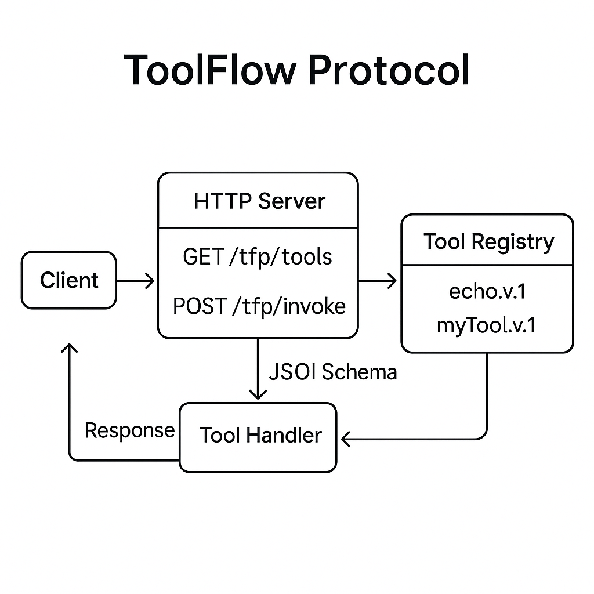

# ToolFlow Protocol (TFP) — Node.js/TypeScript

**By Hive Forensics AI**

A minimalist JSON-first protocol and reference server for building context-aware “tools” (APIs) that any LLM agent—or human—can discover and invoke.

---

## Architecture Diagram



---

## 🚀 Features

* **Simple JSON protocol**: `/tfp/tools` for discovery, `/tfp/invoke` for calls
* **Type-safe**: Zod runtime validation + full TypeScript types
* **LLM and RAG Ready**: Out-of-the-box OpenAI, Ollama, and vector-store RAG pipelines
* **Extensible**: drop-in `registerTool()` for new handlers
* **Environment-configurable**: `.env` support for easy deployment
* **CLI-friendly**: test instantly with `curl` or your favorite HTTP client

---

## 🏁 Quick Start

```bash
# 1️⃣ Clone or unzip
git clone https://github.com/HiveForensics-AI/toolflow-tfp.git
cd toolflow-tfp

# 2️⃣ Install dependencies
npm install

# 3️⃣ Copy and edit environment variables
cp .env.example .env
# Edit .env and set your OpenAI key or point to an Ollama server

# 4️⃣ Launch in dev mode (hot reload)
npm run dev
# → http://localhost:3000

# 5️⃣ Try it!
curl http://localhost:3000/tfp/tools

curl -X POST http://localhost:3000/tfp/invoke \
     -H "Content-Type: application/json"      \
     -d '{
           "toolId": "echo.v1",
           "input": { "text": "Hello, Hive!" }
         }'
```

You should see:

```json
{
  "requestId": "...",
  "toolId": "echo.v1",
  "output": { "echoed": "Hello, Hive!" },
  "metadata": {
    "durationMs": 2,
    "timestamp": "2025-07-05T14:23:00.123Z",
    "status": "success"
  }
}
```

---

## 📁 Project Structure

```
.
├── .env.example           # Environment variable template
├── package.json           # scripts & dependencies
├── tsconfig.json          # strict TS setup
├── README.md              # ← this file
└── src/
    ├── protocol/
    │   └── types.ts       # Core Zod schemas & TS types
    ├── tools/
    │   ├── echo.ts        # Example “echo.v1” tool
    │   ├── llmChat.ts     # LLM chat via OpenAI or Ollama
    │   └── ragSearch.ts   # RAG tool over vector store
    ├── llm/
    │   ├── openaiAdapter.ts
    │   └── ollamaAdapter.ts
    ├── rag/
    │   └── vectorStore.ts
    ├── server.ts          # Express app with /tfp endpoints
    └── index.ts           # Bootstraps server on port 3000
```

---

## 🌱 Environment Setup

1. **Copy the example and fill in your keys:**

   ```bash
   cp .env.example .env
   # Edit .env for your OpenAI API key, Ollama base URL, etc.
   ```

2. **Environment Variables Overview:**

   ```
   # ---------- OpenAI ----------
   OPENAI_API_KEY=sk-...
   OPENAI_MODEL=gpt-4o-mini
   OPENAI_EMBED_MODEL=text-embedding-3-small

   # ---------- Ollama ----------
   OLLAMA_BASE_URL=http://localhost:11434
   OLLAMA_MODEL=llama3
   OLLAMA_EMBED_MODEL=llama3

   # ---------- Vector Store ----------
   VECTOR_STORE_PATH=vectorStore.json

   # ---------- Server ----------
   PORT=3000
   ```

---

## 🤖 Built-in Tools & How to Use

### 1. `echo.v1` (basic example)

```bash
curl -X POST http://localhost:3000/tfp/invoke \
     -H "Content-Type: application/json"      \
     -d '{"toolId":"echo.v1","input":{"text":"Hello world"}}'
```

### 2. `llm.chat` (OpenAI or Ollama completion)

```bash
curl -X POST http://localhost:3000/tfp/invoke \
     -H "Content-Type: application/json"      \
     -d '{"toolId":"llm.chat","input":{"prompt":"Say hi!","provider":"openai"}}'
```

or (for Ollama, if running locally):

```bash
curl -X POST http://localhost:3000/tfp/invoke \
     -H "Content-Type: application/json"      \
     -d '{"toolId":"llm.chat","input":{"prompt":"Say hi!","provider":"ollama"}}'
```

**Response:**

```json
{
  "requestId": "...",
  "toolId": "llm.chat",
  "output": { "completion": "Hi there!" },
  "metadata": { ... }
}
```

### 3. `rag.search` (RAG retrieval & LLM answer)

Retrieve relevant docs from your local vector store and get an LLM answer:

```bash
curl -X POST http://localhost:3000/tfp/invoke \
     -H "Content-Type: application/json"      \
     -d '{"toolId":"rag.search","input":{"query":"What is TFP?","provider":"openai","topK":3}}'
```

**Response:**

```json
{
  "requestId": "...",
  "toolId": "rag.search",
  "output": {
    "answer": "TFP stands for ToolFlow Protocol, a minimal JSON-first API system ...",
    "docs": [
      { "id": "...", "text": "ToolFlow Protocol (TFP) is ..." },
      ...
    ]
  },
  "metadata": { ... }
}
```

> **Note:**
> The RAG tool uses a simple in-memory JSON vector store.
> Add documents using code via the `addDoc()` function in `src/rag/vectorStore.ts`.

---

## ➕ Adding Your Own Tool

1. **Create** `src/tools/myTool.ts`:

   ```ts
   import { z } from 'zod';
   import { ToolDescriptor } from '../protocol/types';

   export const inputSchema = z.object({
     foo: z.string(),
     bar: z.number().optional()
   });
   export const outputSchema = z.object({
     result: z.string()
   });

   export const descriptor: ToolDescriptor = {
     toolId: 'myTool.v1',
     name: 'My Tool',
     description: 'Does something awesome with foo and bar.',
     version: '1.0.0',
     inputSchema,
     outputSchema,
     tags: ['example','demo']
   };

   export async function handler(input: z.infer<typeof inputSchema>) {
     return { result: `You sent foo=${input.foo}` };
   }
   ```

2. **Register** it in `src/server.ts`:

   ```ts
   import { descriptor as myDesc, handler as myHandler } from './tools/myTool';
   // …
   registerTool(myDesc, myHandler);
   ```

3. **Restart** your server—now `/tfp/tools` lists `myTool.v1` and you can invoke it!

---

## 🔍 Error Handling

You’ll get structured JSON errors for unknown tools or invalid input.

**Unknown tool:**

```json
{
  "requestId": "...",
  "toolId": "nope.v1",
  "metadata": { "timestamp": "...", "status": "error" },
  "error": { "code": "ToolNotFound", "message": "Unknown tool" }
}
```

**Validation error:**

```json
{
  "requestId": "...",
  "toolId": "echo.v1",
  "metadata": { "timestamp": "...", "status": "error" },
  "error": {
    "code": "ZodError",
    "message": "Expected string, received number at path: text"
  }
}
```

---

## 🧪 Testing with `curl` & Postman

* **List tools:**
  `GET http://localhost:3000/tfp/tools`
* **Invoke tool:**
  `POST http://localhost:3000/tfp/invoke`
  Header: `Content-Type: application/json`
  Body example:

  ```json
  {
    "toolId": "llm.chat",
    "input": { "prompt": "Hello!" }
  }
  ```

---

## 📦 Building & Deployment

```bash
# Build for production
npm run build

# Start compiled server
npm start

# Or run in Docker:
docker build -t hive-tfp:latest .
docker run -p 3000:3000 hive-tfp:latest
```

---

## 📚 Next Steps & Customization

* Add custom LLM or RAG adapters (just create a tool!)
* Build a front-end that lists/discovers all registered tools
* Integrate authentication (API key, JWT)
* Add observability (Prometheus, OpenTelemetry)
* Plug in additional vector stores (Pinecone, Qdrant, etc.)
* Generate a client SDK from `/tfp/tools` manifest

---

## 📜 License

Apache 2.0 — see [LICENSE](LICENSE)

---

Happy building! 🚀

